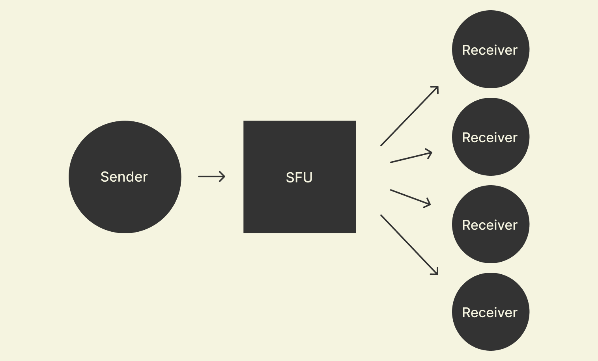
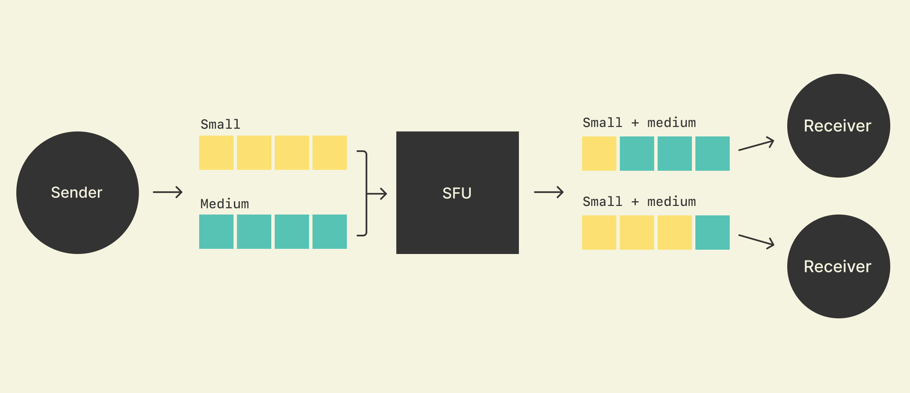

# Signal | 如何用Rust构建大规模端到端加密通话

> 原文： [https://signal.org/blog/how-to-build-encrypted-group-calls/](https://signal.org/blog/how-to-build-encrypted-group-calls/)

## 前言

本文不是对原文的完整翻译，只是关键摘要。

Signal是由Signal技术基金会和Signal Messenger LLC开发的跨平台加密消息服务。Signal经互联网发送一对一及组群消息，消息可包含图像及视频，它还可以用来经互联网作一对一及组群语音通话。非营利组织Signal基金会于2018年2月成立， Brian Acton 提供了初期5000万美元之初始资金。自2021年1月，Signal已获得超过1亿5百万之下载总量，并且该软件拥有约4千万月活跃用户。截止2021-2-14，Signal已被安装于超过5千万台android设备上。2021年因为 WhatsApp 修改隐私条款，马斯克呼吁大众使用 Signal 。

Signal依赖于由Signal Messenger维护的集中式服务器。 除了路由Signal的消息外，服务器还有助于发现同时也是Signal用户注册的联系人以及自动交换用户的公共密钥。 默认情况下，Signal的语音和视频通话是双方的直接连接。如果调用者不在接收者的通讯簿中，则将调用路由通过服务器以隐藏用户的IP地址。

Signal内部也大量使用 Rust 语言，并且[开源](https://github.com/signalapp)了一些服务和组件库。其中包括了 [Signal-Calling-Service](https://github.com/signalapp/Signal-Calling-Service)调用服务，该服务帮助 Signal 支持端到端加密群组通话规模扩展到40人。本文就是阐述了 Signal-Calling-Service 的原理。

## 开源调用服务 Signal-Calling-Service 原理

### 选择性转发单元 (SFU，Selective Forwarding Units)

在群组通话中，每一方都需要将他们的音频和视频发送给通话中的所有其他参与者。有 3 种可能的通用架构可以这样做：

- 全网（Full mesh）：每个呼叫参与者将其媒体数据（音频和视频）直接发​​送给其他呼叫参与者。这只适用于小规模的呼叫，但不适用于参与者多的情况。大多数人的网络连接速度不够快，无法同时发送 40 个视频副本。
- 服务器混合（Server mixing）：每个呼叫参与者将其媒体数据发送到服务器。服务器将媒体“混合”在一起并将其发送给每个参与者。这适用于许多参与者，但与端到端加密不兼容，因为它要求服务器能够查看和更改媒体数据。
- 选择性转发（Selective Forwarding）：每个参与者将其媒体发送到服务器。服务器将媒体“转发”给其他参与者而不查看或更改它。这适用于许多参与者，并且与端到端加密兼容。

由于 Signal 必须具有端到端加密并扩展到许多参与者，因此使用选择性转发。执行选择性转发的服务器通常称为选择性转发单元或 SFU。



SFU 的主循环逻辑 Rust 代码简化版为：

```rust
let socket = std::net::UdpSocket::bind(config.server_addr);  
let mut clients = ...;  // changes over time as clients join and leave
loop {
  let mut incoming_buffer = [0u8; 1500];
  let (incoming_size, sender_addr) = socket.recv_from(&mut incoming_buffer);
  let incoming_packet = &incoming_buffer[..incoming_size];

  for receiver in &clients {
     // Don't send to yourself
     if sender_addr != receiver.addr {
       // Rewriting the packet is needed for reasons we'll describe later.
       let outgoing_packet = rewrite_packet(incoming_packet, receiver);
       socket.send_to(&outgoing_packet, receiver.addr);
     }
  }
}
```

实际上 Signal 团队考察了很多开源的 SFU 实现，但是符合拥塞控制（congestion control）的只有两个，然而还需要大量修改才最多支持8个参与者。因此，他们才决定用 Rust 重新实现一个新的 SFU。目前，它已经为 Signal 线上服务九个月，可以轻松扩展到40个参与者（未来会更多）。可以作为基于 WebRTC 协议实现 SFU 的参考实现，代码可读性非常高。并且借鉴了 [googcc](https://datatracker.ietf.org/doc/html/draft-ietf-rmcat-gcc-02) 的拥塞控制算法。


### SFU 最困难的部分

SFU 最困难的部分是在网络条件不断变化的同时将正确的视频分辨率转发给每个呼叫参与者。

这个困难是以下基本问题的组合：

- 每个参与者的网络连接容量都在不断变化并且很难知道。如果 SFU 发送过多，则会造成额外的延迟。如果 SFU 发送的太少，质量就会很低。因此，SFU 必须不断仔细地调整它发送给每个参与者的数量，以使其“恰到好处”。
- SFU 不能修改它转发的媒体数据。要调整它发送的数量，它必须从发送给它的媒体数据中进行选择。如果可供选择的“选项”仅限于发送可用的最高分辨率或根本不发送，则很难适应各种网络条件。因此，每个参与者必须向 SFU 发送多种分辨率的视频，并且 SFU 必须不断小心地在它们之间切换。

解决方案是结合几种我们将单独讨论的技术：

- 联播（Simulcast）和数据包重写（Packet Rewriting）允许在不同的视频分辨率之间切换。
- 拥塞控制（Congestion Control）确定要发送的正确数量。
- 速率分配（Rate Allocation）决定在该预算内发送什么内容。

#### 联播（Simulcast）和数据包重写（Packet Rewriting）

为了让 SFU 能够在不同分辨率之间切换，每个参与者必须同时向 SFU 发送许多层（layers，分辨率），这就叫联播（Simulcast），俗称大小流。它是 WebRtc 中的一个概念。



- 上行一般是三路流，按分辨率和码率，一般分为fhq(大中小)三层
- 下行可以分给不同的用户不同的流，比如网不好时分发个小流q，网变好了再切回大流f

SFU 与视频流服务器不同，它不存储任何内容，它的转发必须是即时的，它通过称为数据包重写的过程来实现。

数据包重写是更改媒体数据包中包含的时间戳、序列号和类似 ID 的过程，这些 ID 指示数据包在媒体时间线上的位置。它将来自许多独立媒体时间线（每层一个）的数据包转换为一个统一的媒体时间线（一层）。

数据包重写与端到端加密兼容，因为在端到端加密应用于媒体数据之后，发送参与者将重写的 ID 和时间戳添加到数据包中。这类似于使用 TLS 时加密后如何将 TCP 序列号和时间戳添加到数据包中。

#### 拥塞控制

拥塞控制是一种确定通过网络发送多少的机制：不要太多也不要太少。它的历史悠久，主要是TCP的拥塞控制形式。不幸的是，TCP 的拥塞控制算法通常不适用于视频通话，因为它们往往会导致延迟增加，从而导致通话体验不佳（有时称为“滞后”）。为了为视频通话提供良好的拥塞控制，WebRTC 团队创建了 [googcc](https://datatracker.ietf.org/doc/html/draft-ietf-rmcat-gcc-02) ，这是一种拥塞控制算法，可以确定正确的发送量，而不会导致延迟大幅增加。

拥塞控制机制通常依赖于某种从包接收方发送到包发送方的反馈机制。googcc 旨在与 [transport-cc](https://datatracker.ietf.org/doc/html/draft-holmer-rmcat-transport-wide-cc-extensions-01) 一起使用，该协议中接收方将定期消息发送回发送方，例如，“我在时间 Z1 收到数据包 X1；在时间 Z2 的数据包 X2，……”。然后发送方将这些信息与自己的时间戳结合起来，例如，“我在 Y1 时间发送了数据包 X1，它在 Z1 被接收到；我在时间 Y2 发送了数据包 X2，然后在 Z2 收到了它……”。

在Signal Calling Service中，以流处理的形式实现了googcc和transport-cc。流管道的输入是上述关于数据包何时发送和接收的数据，我们称之为[acks](https://github.com/signalapp/Signal-Calling-Service/blob/v1.3.0/src/transportcc.rs#L60)。管道的输出是应该通过网络发送多少的变化，称之为目标发送速率。

流程的前几步是绘图确认延迟与时间的关系图，然后计算斜率以确定延迟是增加、减少还是稳定。最后一步根据当前的斜率决定要做什么。代码的简化版本如下所示：

```rust
let mut target_send_rate = config.initial_target_send_rate;
for direction in delay_directions {
  match direction {
    DelayDirection::Decreasing => {
      // While the delay is decreasing, hold the target rate to let the queues drain.
    }
    DelayDirection::Steady => {
      // While delay is steady, increase the target rate.
      let increase = ...;
      target_send_rate += increase;
      yield target_send_rate;
    }
    DelayDirection::Increasing => {
      // If the delay is increasing, decrease the rate.
      let decrease = ...;
      target_send_rate -= decrease;
      yield target_send_rate;
    }
  }
}
```

拥塞控制很难，但是现在它基本可以用于视频通话：

- 发送方选择一个初始速率并开始发送数据包。
- 接收方发送回有关何时收到数据包的反馈。
- 发送方使用该反馈根据上述规则调整发送速率。

#### 速率分配

现在 SFU 已经知道要发送多少，接下来就必须确定要发送什么内容（要转发哪些层），这个过程被称为速率分配。

这个过程就像 SFU 从受发送速率预算约束的层菜单中进行选择。例如，如果每个参与者发送 2 个层，而还有 3 个其他参与者，则菜单上总共有 6 个层。

如果预算足够大，我们可以发送我们想要的所有内容（直到每个参与者的最大层）。但如果没有，我们必须优先考虑。为了帮助确定优先级，每个参与者通过请求最大分辨率来告诉服务器它需要什么分辨率。使用该信息，我们使用以下规则进行费率分配：

- 大于请求的最大值的层被排除在外。例如，如果只查看小视频网格，则无需发送每个视频的高分辨率。
- 较小的层优先于较大的层。例如，最好以低分辨率查看每个人，而不是以高分辨率查看某些人而其他人则根本不查看。
- 较大的请求分辨率优先于较小的请求分辨率。例如，一旦可以看到所有人，那么认为最大的视频将在其他视频之前以更高的质量填充。

代码的简化版本如下所示：

```rust
// The input: a menu of video options.
// Each has a set of layers to choose from and a requested maximum resolution.
let videos = ...;

// The output: for each video above, which layer to forward, if any
let mut allocated_by_id = HashMap::new();
let mut allocated_rate = 0;

// Biggest first
videos.sort_by_key(|video| Reverse(video.requested_height));

// Lowest layers for each before the higher layer for any
for layer_index in 0..=2 {
  for video in &videos {
    if video.requested_height > 0 {
      // The first layer which is "big enough", or the biggest layer if none are.
      let requested_layer_index = video.layers.iter().position(
         |layer| layer.height >= video.requested_height).unwrap_or(video.layers.size()-1)
      if layer_index <= requested_layer_index {
        let layer = &video.layers[layer_index];
        let (_, allocated_layer_rate) = allocated_by_id.get(&video.id).unwrap_or_default();
        let increased_rate = allocated_rate + layer.rate - allocated_layer_rate;
        if increased_rate < target_send_rate {
          allocated_by_id.insert(video.id, (layer_index, layer.rate));
          allocated_rate = increased_rate;
        }
      }
    }
  }
}

```

#### 整合

通过结合这三种技术，就有一个完整的解决方案：

- SFU 使用 googcc 和 transport-cc 来确定它应该向每个参与者发送多少。
- SFU 使用速率分配来选择要转发的视频分辨率（层）。
- SFU 将多个层的数据包重写为每个视频流的一层。

结果是每个参与者都可以在给定当前网络条件的情况下以最佳方式查看所有其他参与者，并且与端到端加密兼容。

### 端到端加密

说到端到端加密，值得简要描述它的工作原理。因为它对服务器完全不透明，所以它的代码不在服务器中，而是在客户端中。特别是，我们的实现存在于[RingRTC](https://github.com/signalapp/ringrtc)，一个用 Rust 编写的开源视频通话库。

每个帧的内容在被分成数据包之前都经过加密，类似于[SFrame](https://datatracker.ietf.org/wg/sframe/about/)。有趣的部分实际上是密钥分发和轮换机制，它必须对以下场景具有鲁棒性：

- 未加入呼叫的人必须无法解密他们加入之前的媒体数据。如果不是这种情况，可以获取加密媒体数据的人（例如通过破坏 SFU）将能够在他们加入之前知道呼叫中发生的事情，或者更糟的是，从未加入过。
- 离开通话的人必须无法解密他们离开后的媒体。如果不是这种情况，可以得到加密媒体的人就可以知道他们离开后通话中发生了什么。

为了保证这些属性，我们使用以下规则：

- 当客户端加入呼叫时，它会生成一个密钥并通过 Signal 消息（它们本身是端到端加密的）将其发送到呼叫的所有其他客户端，并在将其发送到 SFU 之前使用该密钥加密媒体数据。
- 每当任何用户加入或离开通话时，通话中的每个客户端都会生成一个新密钥并将其发送给通话中的所有客户端。然后它在 3 秒后开始使用该密钥（允许客户端有一段时间接收新密钥）。

使用这些规则，每个客户端都可以控制自己的密钥分配和轮换，并根据呼叫中的人而不是受邀参加呼叫的人来轮换密钥。这意味着每个客户端都可以验证上述安全属性是否得到保证。

## 小结

在该文章相关的 [Reddit 讨论贴](https://www.reddit.com/r/rust/comments/rh9w4j/signal_now_supports_group_calls_up_to_40_people/)中，该库作者表示：

1. 很喜欢用 Rust 来写这个项目，并且认为 Rust 是实现这类项目最好的语言。
2. 关于优化性能有两点努力：
    - 通过使用 epoll 和多线程，使读写数据包的代码更快、更并发。
    - 将我们的锁定更改为更细粒度。
3. 认为服务器的所有主要逻辑对性能的影响几乎没有一般的“通过服务器推送大量数据包”那么重要。
4. RingRTC 通过 JNI 将 Rust 代码整合到 Android 平台。